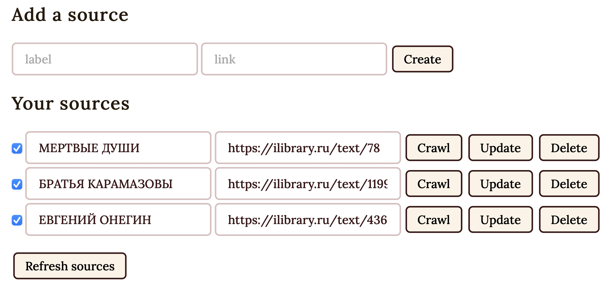
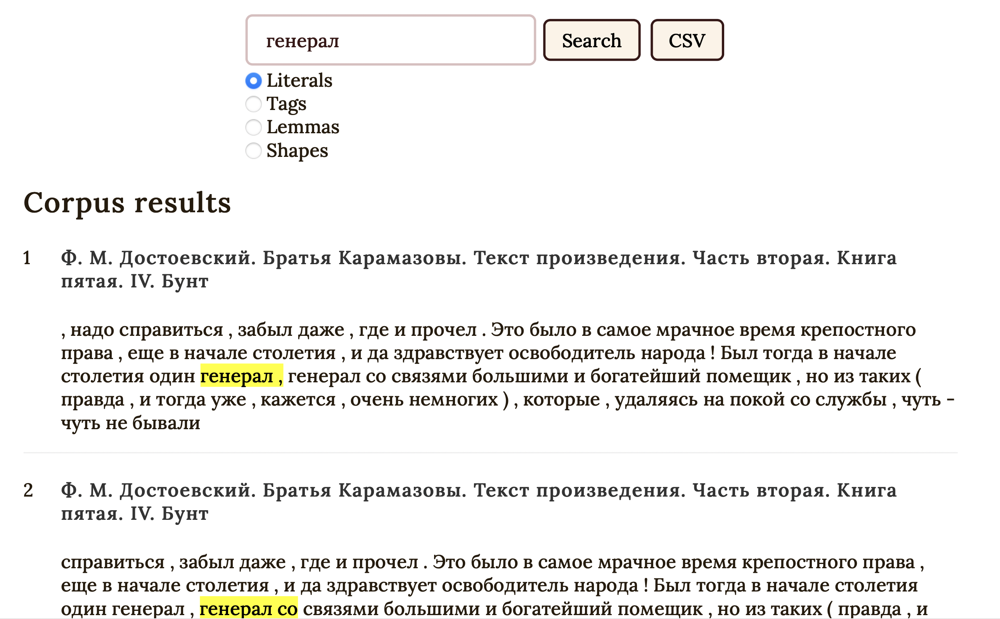
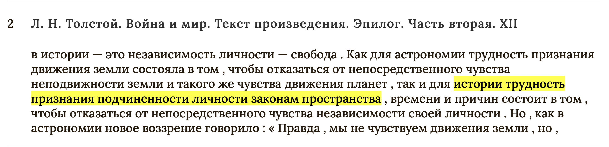
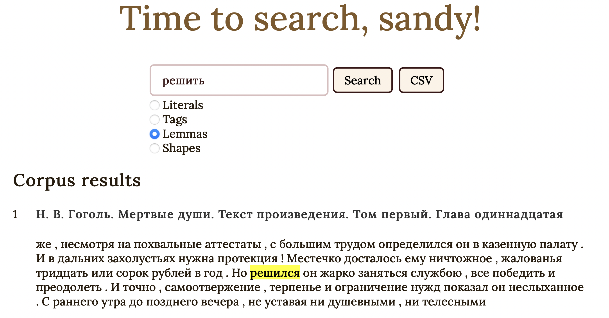
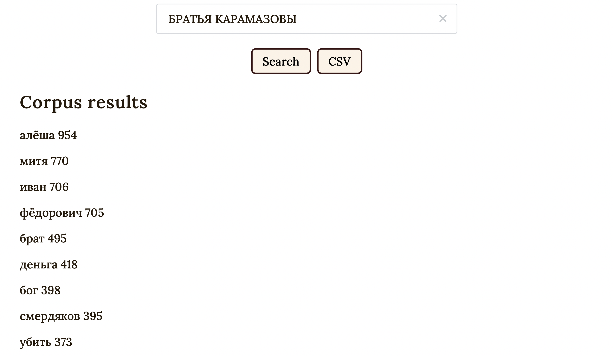

```{=org}
#+latex_compiler: xelatex
```
# Introduction

The need for linguistic analysis has been increasing steadily over the
past couple of decades. As the interest and the number of research
questions increased, so did the demand for amount of language data and
its observations. Unfortunately, one cannot spend his time meticulously
searching for words and constructs in question, as such endeavor might
take a lifetime or two to complete. Everyone should agree that human
time should be spent more preciously, so we employ computers and
automated systems to collect and analyze linguistic data en masse.

Let us define a corpus to be a vast (or smaller) collection of authentic
text, such as literature, transcripts of real-life conversations,
newspapers, etc. Corpus linguistics will be defined as a discipline of
linguistics, which relies on inquiries and results based on such a
corpus. This allows researchers to process large amounts of data that
could not have been parsed before, simply due to limitations in both the
human time and resources. Katya is an example of such a corpus that
focuses on features that will allow researchers to do what no other
existing and commercial corpora provide.

# Motivation

There are many existing corpora, one of our main interest is the Russian
National Corpus (RNC). It has Russian texts and Russian observations,
with some parallel corpora included. We will focus on the Russian part
of the corpus. RNC allows a user to search for a word or a
grammatical/lexical structure, where it will return a paginated list of
results. The search options of RNC are very powerful, as they allow for
a vast array of options: non-contiguous matches, lemmas, parts of
speech, etc. However, there are several severe limitations, which work
against even the advanced users.

The first issue is that RNC\'s database of texts and corpus data is
dictated and set by the organization that manages it. This means that
the data that is returned and processed cannot be modified or tuned by
the end-user. This introduces multiple issues, as the data could be
biased depending on the type of data RNC stores and the format they
return their results in.

Secondly, the results themselves are not complete. Even if a search term
has over five hundred results, RNC does not allow the user to export all
of the results, only allowing a CSV export of couple of hundred of
search results. To circumvent this, one should go through each page and
manually copy the results. This defeats the whole purpose of using a
corpus, if the corpus does not return all the results.

Thirdly, if RNC lacks a specific feature or an analysis component, it is
impossible to make RNC return such a result, as the infrastructure of
RNC is proprietary, meaning each feature request should be submitted
directly to the organization maintaining RNC. An open-source corpus
alternative would be able to allow users to inspect how such a corpus
operates and allow interesting developers to submit features, which
would complete corpus features based on demand.

# The Liberated Corpus

Katya is a liberated corpus that is focused on addressing the issues
above. The big difference of Katya is that it allows users to provide
their own web link, which will serve as a source of data that can be
queried later. Katya accomplishes this by web scraping user link. More
on that in the next section. Katya is capable of exporting complete
search results. Another advantage is that Katya\'s code and
infrastructure is public, such that anyone could learn how it works for
educational purposes and other developers could contribute to the
platform.

# Account Management

Katya allows users to have their own accounts on the system, where each
user is able to add their own source to their account, such that their
queries are isolated to their own selection. This allows a researcher to
make results only include specific works and texts.

To secure users\' accounts and data, state-of-the-art security policies
are enacted within Katya. Every inbound and outbound connection within
Katya\'s infrastructure is authenticated and encrypted. Many security
measures are deployed, however, their exhaustive description is out of
scope of this paper.

# Access

Anyone with an account can access Katya at
[katya.sandyuraz.com](https://katya.sandyuraz.com). On first opening it
will prompt for a username and password. For developers, the backbone of
Katya is located at
[katya-api.sandyuraz.com](https://katya-api.sandyuraz.com), which allows
for a direct REST API access. The source code of the website and the
source code of the analysis backend are hosted at
[github.com/thecsw/katya](https://github.com/thecsw/katya) and
[github.com/thecsw/katya-dev](https://github.com/thecsw/katya-dev),
respectively.

# Sources

A user is able to submit their own links as data sources and assign
friendlier labels to them. Upon submission, a user can trigger a crawl.
Katya will start crawling process by recursively selecting links from
any found web pages, following the links, and exhaustively extracting
all human-readable text (filtered from scripts and
linguistically-irrelevant data). [Scrapy](https://scrapy.org) is the web
scraping module that allows us to do so, while [Beautiful
Soup](https://beautiful-soup-4.readthedocs.io/en/latest/) combined with
[Spacy](https://spacy.io) perform the tokenization and text
classification, which is later permanently stored in Katya\'s central
database.

A note that a source that has been scraped at least once will stay in
the system permanently. If two users wish to add the same web link,
Katya will intelligently link those two users to the same source,
without the need of crawling it superfluously. When a user \"deletes\" a
source, it is actually retained within the system, awaiting for any
possible future linkages with other users. This makes Katya extremely
efficient in memory storage and compute units required.

The figure below shows the interface that is presented to the user,
where the user is able to add new sources, update/delete existing ones,
enable/disable them in queries, and trigger crawls.



# Searches

The main functionality is focused on performing fast and reliable
linguistic queries across all sources that are enabled by the user.
Katya currently allows to search the corpus based on four input types:
literals, tags, lemmas, and shapes.

## Literals

Literal search will return in text that matches the input absolutely,
this means it matches on a character-by-character basis (ignoring
casing). As an example, let me search for Russian \"general\"
appearances in Dostoevsky\'s \"Brothers Karamazov\"



## Tags

Tags search allows the user to search by parts-of-speech. Imagine we
wanted to find an occurrence of seven continuous nouns, we would search
for a tag string `noun noun noun noun noun noun noun`{.verbatim}, which
would faithfully show us



Similar searches for tags can be done with keywords `noun`{.verbatim},
`propn`{.verbatim}, `adj`{.verbatim}, `punct`{.verbatim},
`adv`{.verbatim}, `cconj`{.verbatim}, `adp`{.verbatim}, and
`verb`{.verbatim}.

## Lemmas

Lemma search is similar to the literal one, with the main difference is
that the search will go over non-conjugated standard forms of words.
This is a powerful tool for finding all forms in which a word can be
used in



## Shapes

This is an experimental search type that I do not believe any of corpora
offer. This search type allows you to specify the length of words you
would want to get in the results. For example, a shape of
`Xxxxx`{.verbatim} will match `Apple`{.verbatim}.

# Word frequency

There is a big interest in learning the distribution of word
frequencies, such as what words appear the most or the least in any
given work/source. Russian National Corpus provides this functionality,
however, it only returns fewer than five hundred most frequent lemmas.
Katya has the separate functionality, where a user can select one of
their active sources and get a full CSV file with every lemma found
across all texts associated with the source. Here is an example of the
word frequency analysis of Brothers Karamazov



It is an interesting observation that excluding all the names, the top
words stand for \"brother\", \"money\", \"God\", and \"to kill\".
Funnily enough, this list succinctly summarizes the work as well.

# Further development

First version of Katya has been released and is available at
[katya.sandyuraz.com](https://katya.sandyuraz.com). Thanks to the design
of Katya, it is easily extensible, such that we can add additional
modules at no cost. One of big improvements that will follow is advanced
text cleanup. During scraping, our parsers might extract noisy contents,
such as website\'s headers, footers, menus, etc. Advanced algorithms,
such as [Longest Common
Subsequence](https://en.wikipedia.org/wiki/Longest_common_subsequence_problem)
can help us to remove duplicated text from scraped texts. One other big
feature missing is the ability to create accounts.
